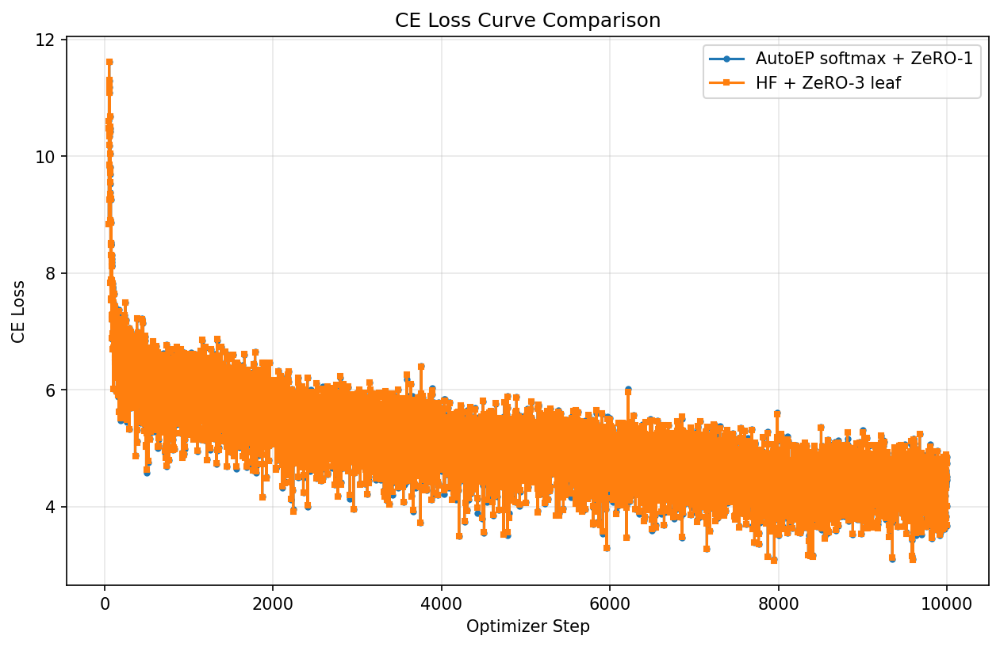
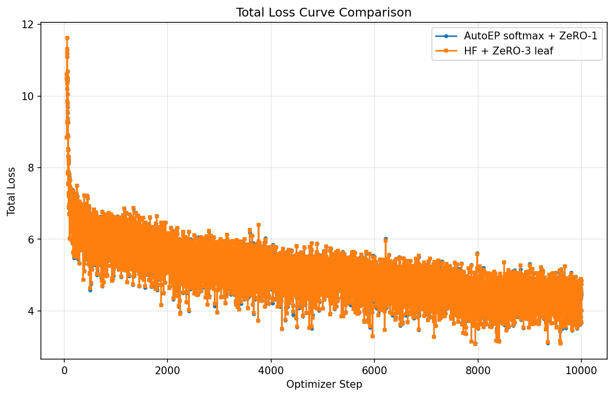
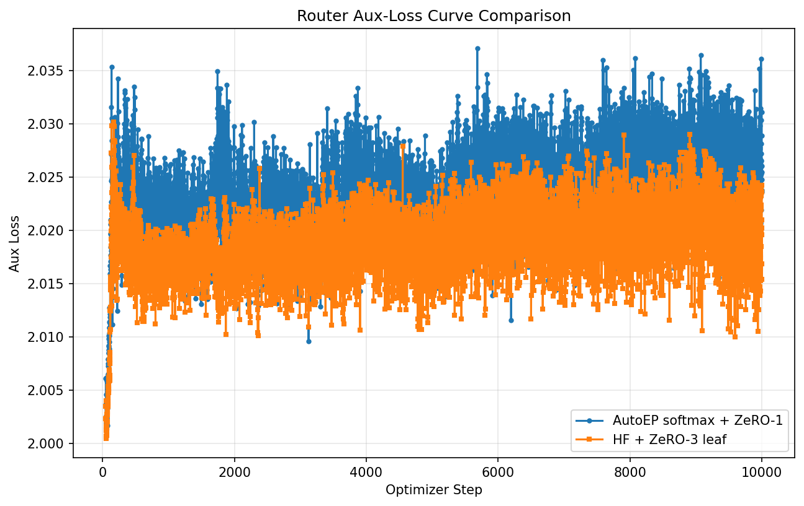

# Qwen3.5 AutoEP Verification

This procedure verifies the current expert-parallel sample with the `qwen3_5`
model preset, Hugging Face Wikitext data, the original Qwen3.5-MoE text config
with only `--num_layers 8` overridden, and AutoEP structural injection metadata.

The Qwen3.5 AutoEP aux-loss verification uses:

- artifact root: `/mnt/local_storage/qwen35_kernel_speed_aux_20260502`
- sample path: `/home/ray/default/dev_ds/DeepSpeedExamples/training/expert_parallel`
- DeepSpeed path on `PYTHONPATH`: `/mnt/user_storage/ds_gittrees/verify-autoep-qwen35-release-evidence`
- Transformers path on `PYTHONPATH`: `/mnt/user_storage/ds_dep_libs/transformers/src`
- model preset: `qwen3_5`
- AutoEP preset: `qwen3_5_moe`
- layers: `8`
- dataset: `wikitext`, `dataset_percentage=10.0`
- tokenizer: `Qwen/Qwen3-0.6B`
- sequence length: `1024` for the representative reproducible command
- micro batch size: `1`
- gradient accumulation: `4`
- world size: `8`
- effective tokens per update: `32768`
- seed: `42`
- observed-results run steps: `100`, warmup steps: `50`
- 10k aux-loss chart source: `task_b_aux_10k/results_softmax`
- shared init SHA256: `97760d09b132f697de7f6ccf6d2d70070fe1def048b8495b0870c2c49a40bf81`

AutoEP uses the sample's built-in config for `--mode autoep`: bf16, AdamW,
ZeRO stage 1, `expert_parallel.enabled=true`, `autoep_size=8`, and
`preset_model=qwen3_5_moe`. The baseline uses `--mode zero3_leaf`: bf16, AdamW,
ZeRO stage 3, and a ZeRO leaf module for
`transformers.models.qwen3_5_moe.modeling_qwen3_5_moe.Qwen3_5MoeSparseMoeBlock`.

The Wikitext loader filters empty/whitespace-only text rows before tokenization.
Without that filter, Wikitext rows containing only padding can produce all
`-100` labels and a non-finite first loss.

## HF Aux-Loss Contract

The aux-loss verification consumes the Hugging Face Qwen3.5-MoE contract
directly from
`/mnt/user_storage/ds_dep_libs/transformers/src/transformers/models/qwen3_5_moe/modeling_qwen3_5_moe.py`
at git SHA `6ed93c04c43f8f4c16b1cd10b9244446f8865095`.

`Qwen3_5MoeCausalLMOutputWithPast(ModelOutput)` exposes both `router_logits`
and `aux_loss`. When `output_router_logits` is enabled,
`Qwen3_5MoeForCausalLM.forward` computes
`aux_loss = load_balancing_loss_func(outputs.router_logits, self.num_experts, self.num_experts_per_tok, attention_mask)`,
adds `router_aux_loss_coef * aux_loss` to `loss` when labels exist, and returns
`MoeCausalLMOutputWithPast(loss=loss, aux_loss=aux_loss, router_logits=outputs.router_logits, ...)`.

The sample records `loss_total=outputs.loss`, `loss_aux=outputs.aux_loss`, and
uses `loss_ce = loss_total - router_aux_loss_coef * loss_aux` only as a
reporting decomposition.

## Mandatory Qwen3.5 Kernels

Qwen3.5 verification must use the specialized linear-attention kernels. Treat
these as required packages, not optional accelerators:

- `flash-linear-attention` (`import fla`), which provides
  `fla.ops.gated_delta_rule`.
- `causal-conv1d` (`import causal_conv1d`), which provides the causal
  convolution kernels.
- `flash-attn` (`import flash_attn`) for Qwen3.5 full-attention layers when
  the FlashAttention2 attention implementation is requested.
- `tilelang` (`import tilelang`) on H100 with Triton `>= 3.4` for the Qwen3.5
  fast path.

The run is invalid if either
`transformers.utils.import_utils.is_flash_linear_attention_available()` or
`is_causal_conv1d_available()` is false. It is also invalid if runtime
inspection shows fallback to Transformers'
`torch_causal_conv1d_update` or `torch_chunk_gated_delta_rule` in any
`Qwen3_5MoeGatedDeltaNet` layer. The source inspected for this verification
imports `causal_conv1d` behind `is_causal_conv1d_available()` and imports
`fla.ops.gated_delta_rule` behind `is_flash_linear_attention_available()`.

## Environment

Run from:

```bash
cd /home/ray/default/dev_ds/DeepSpeedExamples/training/expert_parallel
export PYTHONPATH=/mnt/user_storage/ds_gittrees/verify-autoep-qwen35-release-evidence:/mnt/user_storage/ds_dep_libs/transformers/src${PYTHONPATH:+:$PYTHONPATH}
export TOKENIZERS_PARALLELISM=false
export HF_HOME=/mnt/local_storage/hf_cache
export HF_DATASETS_CACHE=/mnt/local_storage/hf_datasets_cache
RUN_ROOT=/mnt/local_storage/qwen35_kernel_speed_aux_20260502
INIT=$RUN_ROOT/shared_init/qwen35_l8_seed42.safetensors
```

## Reproduce a Qwen3.5 Example

The broad throughput sweep used for internal release evidence is intentionally
not part of this public-facing sample procedure. To reproduce the same Qwen3.5
environment and run one representative long-sequence aux-loss configuration,
use the single configuration below:

- sequence length: `1024`
- micro batch size: `1`
- gradient accumulation: `4`
- steps: `100`
- warmup steps: `50`
- model layers: `8`
- dataset: `wikitext`, `dataset_percentage=10.0`
- tokenizer: `Qwen/Qwen3-0.6B`
- shared init: `/mnt/local_storage/qwen35_kernel_speed_aux_20260502/shared_init/qwen35_l8_seed42.safetensors`
- aux loss: enabled with `--output_router_logits true`

The verified Anyscale H100 environment used:

| Package | Version / source |
| --- | --- |
| PyTorch | `2.9.1+cu126` |
| Triton | `3.5.1` |
| Transformers | source checkout on `PYTHONPATH`: `/mnt/user_storage/ds_dep_libs/transformers/src` (`5.2.0.dev0` at verification time) |
| DeepSpeed | source checkout on `PYTHONPATH`: `/mnt/user_storage/ds_gittrees/verify-autoep-qwen35-release-evidence` (`0.18.10+851c2841` at verification time) |
| `flash-linear-attention` / `fla` | `0.5.0` |
| `causal-conv1d` | `1.6.1` |
| `flash-attn` | `2.8.3` |
| `tilelang` | `0.1.9` |

Install the Qwen3.5 fast-path kernel dependencies in the `ds` environment before
running verification:

```bash
conda activate ds
python -m pip install \
  flash-linear-attention==0.5.0 \
  causal-conv1d==1.6.1 \
  flash-attn==2.8.3 \
  tilelang==0.1.9
```

Then set the source checkouts and caches:

```bash
cd /home/ray/default/dev_ds/DeepSpeedExamples/training/expert_parallel
export PYTHONPATH=/mnt/user_storage/ds_gittrees/verify-autoep-qwen35-release-evidence:/mnt/user_storage/ds_dep_libs/transformers/src${PYTHONPATH:+:$PYTHONPATH}
export TOKENIZERS_PARALLELISM=false
export HF_HOME=/mnt/local_storage/hf_cache
export HF_DATASETS_CACHE=/mnt/local_storage/hf_datasets_cache
RUN_ROOT=/mnt/local_storage/qwen35_kernel_speed_aux_20260502
INIT=$RUN_ROOT/shared_init/qwen35_l8_seed42.safetensors
```

Run AutoEP for the representative configuration:

```bash
conda run --no-capture-output -n ds deepspeed --num_gpus 8 --master_port 29104 train.py \
  --model qwen3_5 \
  --mode autoep \
  --num_layers 8 \
  --steps 100 \
  --warmup_steps 50 \
  --log_interval 1 \
  --seq_len 1024 \
  --micro_batch_size 1 \
  --grad_accum 4 \
  --seed 42 \
  --dataset_name wikitext \
  --dataset_percentage 10.0 \
  --tokenizer_name Qwen/Qwen3-0.6B \
  --output_router_logits true \
  --load_init_weights "$INIT" \
  --metrics_out "$RUN_ROOT/reproduce_qwen35_bs1_seq1024_ga4_aux/autoep_metrics.csv" \
  --run_metadata_out "$RUN_ROOT/reproduce_qwen35_bs1_seq1024_ga4_aux/autoep_metadata.json"
```

## Import Provenance

Record package paths before launching:

```bash
conda run --no-capture-output -n ds python - <<'PY'
import json
import socket
import torch
import transformers
import deepspeed
import train

preset = train.MODEL_PRESETS["qwen3_5"]
payload = {
    "hostname": socket.gethostname(),
    "torch_version": torch.__version__,
    "cuda_version": torch.version.cuda,
    "transformers_version": transformers.__version__,
    "transformers_file": transformers.__file__,
    "deepspeed_version": getattr(deepspeed, "__version__", "unknown"),
    "deepspeed_file": deepspeed.__file__,
    "qwen3_5_preset": preset,
    "qwen3_5_l8_config": train.build_original_model_config(
        preset["architecture"],
        num_layers=8,
        output_router_logits=True,
    ).to_dict(),
    "autoep_config": train.build_default_deepspeed_config("autoep", preset["architecture"]),
    "zero3_leaf_config": train.build_default_deepspeed_config("zero3_leaf", preset["architecture"]),
}
print(json.dumps(payload, indent=2, sort_keys=True))
PY
```

## Kernel Preflight

Run this preflight before generating init weights. It must exit 0 and must not
print the Transformers missing-fast-path warning.

```bash
conda run --no-capture-output -n ds python - <<'PY'
import importlib
import json
import triton
import torch
from transformers.utils.import_utils import (
    is_causal_conv1d_available,
    is_flash_attn_2_available,
    is_flash_linear_attention_available,
)

import train
from transformers import Qwen3_5MoeForCausalLM
from transformers.models.qwen3_5_moe.modeling_qwen3_5_moe import (
    Qwen3_5MoeGatedDeltaNet,
    torch_causal_conv1d_update,
    torch_chunk_gated_delta_rule,
)

for module_name in ("fla", "causal_conv1d", "flash_attn", "tilelang"):
    importlib.import_module(module_name)

assert is_flash_linear_attention_available(), "flash-linear-attention / fla unavailable"
assert is_causal_conv1d_available(), "causal-conv1d unavailable"
assert is_flash_attn_2_available(), "flash-attn unavailable or too old for FlashAttention2"
triton_major_minor = tuple(int(part) for part in triton.__version__.split(".")[:2])
assert triton_major_minor >= (3, 4), f"Triton >= 3.4 required, got {triton.__version__}"

cfg = train.build_original_model_config(
    train.MODEL_PRESETS["qwen3_5"]["architecture"],
    num_layers=8,
    output_router_logits=True,
)
model = Qwen3_5MoeForCausalLM(cfg).cuda().to(dtype=torch.bfloat16)
linear_layers = [
    module
    for module in model.modules()
    if isinstance(module, Qwen3_5MoeGatedDeltaNet)
]
assert linear_layers, "No Qwen3.5 gated-delta linear-attention layers found"
assert all(layer.causal_conv1d_fn is not None for layer in linear_layers)
assert all(layer.causal_conv1d_update is not torch_causal_conv1d_update for layer in linear_layers)
assert all(layer.chunk_gated_delta_rule is not torch_chunk_gated_delta_rule for layer in linear_layers)

print(json.dumps({
    "linear_attention_layers": len(linear_layers),
    "flash_linear_attention_available": is_flash_linear_attention_available(),
    "causal_conv1d_available": is_causal_conv1d_available(),
    "flash_attn_2_available": is_flash_attn_2_available(),
    "tilelang_available": True,
    "triton_version": triton.__version__,
    "attn_implementation": cfg._attn_implementation,
}, indent=2, sort_keys=True))
PY
```

## Shared Init

Reuse the existing pre-DeepSpeed initialization artifact for both modes:

```bash
sha256sum "$INIT"
```

## 10,000-Step Aux-Loss Evidence

The corrected softmax-router 10k comparison is stored under
`/mnt/local_storage/qwen35_kernel_speed_aux_20260502/task_b_aux_10k/results_softmax`.
It used the same initialization artifact for AutoEP and ZeRO-3 leaf
(`same_init_hash=true`) with aux loss enabled.
The plots embedded below are direct copies of the corrected softmax-router
artifacts from that directory; no synthetic loss curves are retained here.

| Metric | Value |
| --- | --- |
| CE loss mean abs diff, post-warmup | `0.0182` |
| CE loss max abs diff, post-warmup | `0.1389` |
| CE loss Pearson correlation | `0.9995` |
| Aux loss mean abs diff, post-warmup | `0.0045` |
| Aux loss max abs diff, post-warmup | `0.0175` |
| Aux loss Pearson correlation | `0.7352` |







The CE and total-loss curves track closely over 9,950 aligned post-warmup
steps. The aux-loss curves remain close in absolute value but have lower
correlation because the auxiliary signal is small and flatter than the language
model loss; small routing-order differences are therefore more visible in the
correlation statistic.
